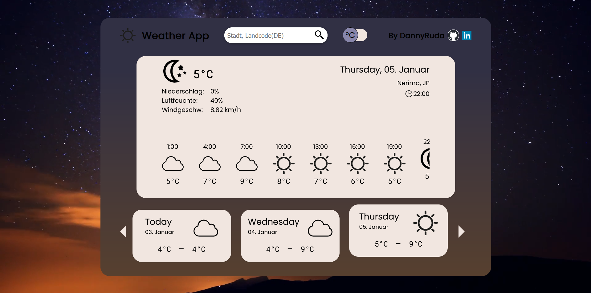

<h1 align="center">Weather App</h1>

## Short Description
----
This web app shows different weather data with the use of the openweathermap api and is packed with small features. 

## Live page
---
Click the link to see the [live page](https://dannyruda.github.io/weather-app/)

## Demo Video
---

Showcases some example features

## Motivation
---
I created this project to practise the use of APIs and to create a project that i can proudly present to people. This project also served the purpose of improving my ability to write clean code. During the creation of this project i was able to collect alot of experience in that regard. I also wanted to create something completly on my own and from scratch, especially the visual design part. 

## Features
---
- Shows weather data for user location if the user permits the browser to detect the location
- Shows weather data for a city entered with the search bar
- Shows detailed weather data in an area of the site, compact weather data for 3 hour steps and compact weather data for each of the next 5 days
- Clicking on one of the 3 hour steps or the daily steps will update the detailed section with the weather data corresponding to the clicked hour/day
- Clicking on a day will update the detailed section with weather data of the first recorded hour of the clicked day and will update the section with the 3 hour steps to show the hourly data of the clicked day
- Toggle Switch with animation that allows to toggle between celsius and fahrenheit. Also has an animation on hover that indicates the effect of clicking the switch.
- Design is changing depending on the weather condition of the currently displayed detailed weather data
- The search bar will suggest cities depending on the currently typed in value that can be searched for when clicking on them
- the hourly data section and the daily data section are both scrollable horizontally with mousewheel and with click and drag

## Technologies used
---
- JavaScript
- CSS3
- HTML 5
- Webpack
- openweathermap API
- ESlint
- Prettier

## Future Improvements
---
- Add an animation that plays when the background image is loaded that indicates that the website is in a loading state
- make color changes also wait for the background video to play

## License
---
MIT License

Copyright (c) [2022] [DannyRuda]

Permission is hereby granted, free of charge, to any person obtaining a copy
of this software and associated documentation files (the "Software"), to deal
in the Software without restriction, including without limitation the rights
to use, copy, modify, merge, publish, distribute, sublicense, and/or sell
copies of the Software, and to permit persons to whom the Software is
furnished to do so, subject to the following conditions:

The above copyright notice and this permission notice shall be included in all
copies or substantial portions of the Software.

THE SOFTWARE IS PROVIDED "AS IS", WITHOUT WARRANTY OF ANY KIND, EXPRESS OR
IMPLIED, INCLUDING BUT NOT LIMITED TO THE WARRANTIES OF MERCHANTABILITY,
FITNESS FOR A PARTICULAR PURPOSE AND NONINFRINGEMENT. IN NO EVENT SHALL THE
AUTHORS OR COPYRIGHT HOLDERS BE LIABLE FOR ANY CLAIM, DAMAGES OR OTHER
LIABILITY, WHETHER IN AN ACTION OF CONTRACT, TORT OR OTHERWISE, ARISING FROM,
OUT OF OR IN CONNECTION WITH THE SOFTWARE OR THE USE OR OTHER DEALINGS IN THE
SOFTWARE.